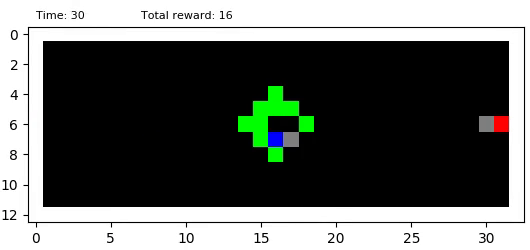
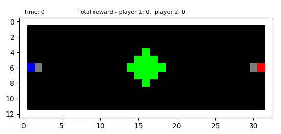
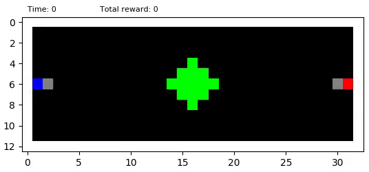
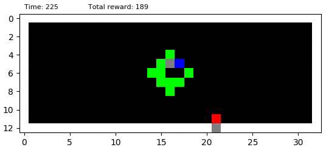
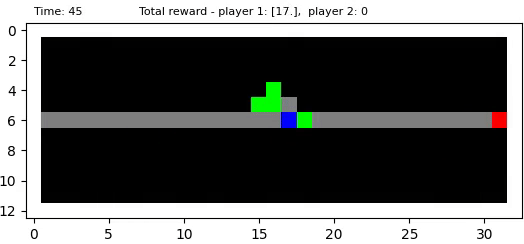

# marl-gathering
Multi Agent Reinforcement Learning in Apple Gathering Game

## Training

To train the agents use scripts `python run_single.py` or `python run_two.py`.

## Evaluation

To evaluate the trained agents and produce a video use `python test_single.py` or `python test_two.py`.

## Gifs

### Supplementary gif 1
Optimal strategy of a single agent trained in isolation.

### Supplementary gif 2
Collaboration of two DQN agents.

### Supplementary gif 3 & 4
DQN playing against a random agent.

### Supplementary gif 5
DQN playing against a random agent in low resource abundance environment.

### Supplementary gif 6
Two DQN agents that learned defecting policy in a low resource abundance environment.

